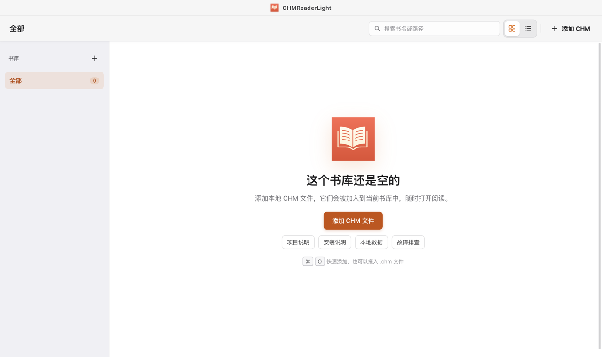

# CHMReaderLight - macOS CHM Reader

[English](./README.en.md)

[](https://github.com/zhongdiandaoda/chm-reader-light/actions/workflows/ci.yml)
[](https://github.com/zhongdiandaoda/chm-reader-light/actions/workflows/codeql.yml)
[](https://github.com/zhongdiandaoda/chm-reader-light/stargazers)
[](./LICENSE)
[](#系统要求)

一个轻量、离线的 macOS CHM 阅读器。用书库管理本地手册，支持目录与正文搜索，不上传文档，也不需要账号。

**[下载 macOS 版本](https://github.com/zhongdiandaoda/chm-reader-light/releases)** · **[从源码运行](#从源码运行)** · **[Star 项目](https://github.com/zhongdiandaoda/chm-reader-light)**



> 截图来自当前 Electron 应用的真实空书库状态，不包含私人 CHM、文件名或本地路径。

## 核心功能

- 书库分组、拖拽导入、书名或路径搜索，以及最近阅读状态。
- 多级目录、目录搜索、正文搜索、上一章/下一章和历史前进/后退。
- 保存缩放、文本编码、侧栏状态、搜索范围和每本书的阅读位置。
- 在 Finder 中定位源文件；源文件移动后可重新定位，移除条目不会删除原文件。
- 默认阻止 CHM 内脚本、表单、弹窗、嵌套 frame 和网络连接。
- 专注支持 Apple Silicon Mac，应用界面不提供遥测、账号或云同步。

## 下载与安装

从 [GitHub Releases](https://github.com/zhongdiandaoda/chm-reader-light/releases) 下载 `CHMReaderLight-mac-arm64.zip`。

每个 zip 都配有 `.zip.sha256`。下载到同一目录后运行：

```bash
shasum -a 256 -c CHMReaderLight-mac-arm64.zip.sha256
```

当前构建尚未完成 Apple notarization。首次启动如被拦截，请在 **系统设置 > 隐私与安全性** 中确认打开。完整步骤见 [安装指南](./docs/install-macos.md)。

## 基本使用

1. 点击“添加 CHM”或把 `.chm` 文件拖入书库。
2. 使用左侧分组整理手册，顶部搜索框可按书名或路径筛选。
3. 打开文档后使用目录或正文搜索；乱码时切换文本编码。
4. 用 `Command+O` 添加文件、`Command+F` 搜索、`Command+L` 返回书库。

应用只记录源文件路径和阅读偏好。数据边界见 [隐私说明](./docs/privacy.md)，格式限制见 [兼容性说明](./docs/compatibility.md)，常见问题见 [故障排查](./docs/troubleshooting.md)。

## 系统要求

- macOS 12 或更高版本
- Apple Silicon Mac
- 从源码运行需要 Node.js 22 或更高版本

## 从源码运行

```bash
npm install
npm run run
```

常用检查：

```bash
npm test
npm run check
```

打包当前架构：

```bash
npm run package:mac
```

## 文档

| 主题 | 文档 |
| --- | --- |
| 安装与首次启动 | [macOS Install Guide](./docs/install-macos.md) |
| CHM 支持范围 | [Compatibility](./docs/compatibility.md) |
| 隐私与本地数据 | [Privacy](./docs/privacy.md) |
| 安全边界 | [Security Model](./docs/security-model.md) |
| 故障排查 | [Troubleshooting](./docs/troubleshooting.md) |
| 代码结构 | [Architecture](./docs/architecture.md) |
| 测试 | [Testing](./docs/testing.md) |
| 发布 | [Release Guide](./docs/release.md) |

## 支持与贡献

- 使用问题和 bug: [SUPPORT.md](./SUPPORT.md) 或 [Issues](https://github.com/zhongdiandaoda/chm-reader-light/issues/new/choose)
- 安全问题: [SECURITY.md](./SECURITY.md)
- 贡献代码: [CONTRIBUTING.md](./CONTRIBUTING.md)
- 行为规范: [CODE_OF_CONDUCT.md](./CODE_OF_CONDUCT.md)

如果 CHMReaderLight 解决了你的离线文档阅读问题，欢迎 [Star 项目](https://github.com/zhongdiandaoda/chm-reader-light)。

[MIT License](./LICENSE) · [THIRD_PARTY_NOTICES.md](./THIRD_PARTY_NOTICES.md)
