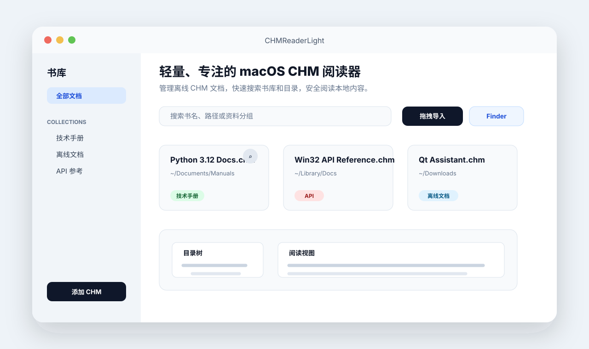

# CHMReaderLight — macOS CHM Reader

[English](./README.en.md)

[](https://github.com/zhongdiandaoda/chm-reader-light/actions/workflows/ci.yml)
[](https://github.com/zhongdiandaoda/chm-reader-light/actions/workflows/codeql.yml)
[](https://scorecard.dev/view/github.com/zhongdiandaoda/chm-reader-light)
[](https://github.com/zhongdiandaoda/chm-reader-light/stargazers)
[](https://github.com/zhongdiandaoda/chm-reader-light/releases)
[](./LICENSE)
[](#macos-打包)
[](./.nvmrc)
[](https://github.com/zhongdiandaoda/chm-reader-light/releases)

A lightweight offline CHM reader and library for macOS. This open-source CHM file viewer supports Apple Silicon and Intel Macs.

一个面向 macOS 的轻量 CHM 阅读器。打开后先进入书库，集中管理本地 CHM 文档；点击某本文档后进入阅读页面，左侧展示可搜索、可折叠的目录树，右侧展示正文，随时可返回书库。

**立即体验：** [查看 macOS 下载](https://github.com/zhongdiandaoda/chm-reader-light/releases) · [本地运行](#本地运行) · [60 秒试用](#60-秒试用路径) · [Star 项目](https://github.com/zhongdiandaoda/chm-reader-light)



## 快速导航

- [下载与体验](#下载与体验)
- [60 秒试用路径](#60-秒试用路径)
- [中文入门指南](./docs/getting-started.zh-CN.md)
- [为什么选择 CHMReaderLight](#为什么选择-chmreaderlight)
- [功能](#功能)
- [支持](#支持)

<details>
<summary>更多文档与项目链接</summary>

- [Getting Started](./docs/getting-started.md)
- [中文功能导览](./docs/feature-tour.zh-CN.md)
- [Feature Tour](./docs/feature-tour.md)
- [中文适用场景](./docs/use-cases.zh-CN.md)
- [Use Cases](./docs/use-cases.md)
- [中文对比指南](./docs/comparison.zh-CN.md)
- [Comparison](./docs/comparison.md)
- [中文演示指南](./docs/demo-guide.zh-CN.md)
- [Demo Guide](./docs/demo-guide.md)
- [中文 CHM 样本指南](./docs/sample-chm-guide.zh-CN.md)
- [Sample CHM Guide](./docs/sample-chm-guide.md)
- [中文分享素材包](./docs/share-kit.zh-CN.md)
- [Share Kit](./docs/share-kit.md)
- [中文 Showcase 指南](./docs/showcase.zh-CN.md)
- [Showcase Guide](./docs/showcase.md)
- [中文采用检查清单](./docs/adoption-checklist.zh-CN.md)
- [Adoption Checklist](./docs/adoption-checklist.md)
- [中文项目状态](./docs/project-status.zh-CN.md)
- [Project Status](./docs/project-status.md)
- [Documentation Index](./docs/index.md)
- [Repository Listing](./docs/repository-listing.md)
- [AI Project Summary](./llms.txt)
- [适合场景](#适合场景)
- [中文搜索指南](./docs/search.zh-CN.md)
- [Search Guide](./docs/search.md)
- [中文无障碍指南](./docs/accessibility.zh-CN.md)
- [本地运行](#本地运行)
- [中文 macOS 安装指南](./docs/install-macos.zh-CN.md)
- [macOS Install Guide](./docs/install-macos.md)
- [中文兼容性说明](./docs/compatibility.zh-CN.md)
- [中文 FAQ](./docs/faq.zh-CN.md)
- [中文故障排查](./docs/troubleshooting.zh-CN.md)
- [中文隐私与本地数据](./docs/privacy.zh-CN.md)
- [中文快捷键指南](./docs/shortcuts.zh-CN.md)
- [macOS 打包](#macos-打包)
- [参与贡献](#参与贡献)
- [中文路线图](./docs/roadmap.zh-CN.md)
- [Roadmap](./docs/roadmap.md)

</details>

## 适合场景

- 在 macOS 上集中管理离线 CHM 技术手册，并保留原始文件所在位置。
- 需要离线查阅旧版 SDK、API 或产品文档，同时希望有目录搜索、阅读历史和缩放偏好。
- 希望在打开未知 CHM 时默认禁用脚本和网络访问，只把内容当成本地文档阅读。

## 为什么选择 CHMReaderLight

- macOS 原生菜单、最近打开文档和 Finder 工作流让离线手册管理更贴近日常使用。
- 只保存本地路径和阅读偏好，不上传、不同步 CHM 内容，适合处理内部或历史资料。
- 把兼容性、安装、隐私和发版流程都写进仓库文档，方便下载前评估，也方便贡献者快速上手。

## 亮点

- 为 macOS 设计的离线 CHM 阅读体验，支持 Apple Silicon 与 Intel Mac。
- 书库只记录源文件路径，不复制、不移动原始 CHM，适合整理技术手册和旧版离线文档。
- 支持拖拽导入、多书库分组、书库搜索、目录搜索、阅读历史、正文缩放、Finder 定位和缺失源文件提示。
- 默认禁用 CHM 内脚本并限制本地资源访问范围，降低打开未知文档时的风险。
- 不包含遥测、账号或云同步；本地数据处理方式见 [中文隐私与本地数据](./docs/privacy.zh-CN.md) 或 [Privacy and Local Data](./docs/privacy.md)。

## 下载与体验

优先从 [GitHub Releases](https://github.com/zhongdiandaoda/chm-reader-light/releases) 下载适合当前 Mac 的构件：

- Apple Silicon：[CHMReaderLight-mac-arm64.zip](https://github.com/zhongdiandaoda/chm-reader-light/releases/latest/download/CHMReaderLight-mac-arm64.zip) · [CHMReaderLight-mac-arm64.zip.sha256](https://github.com/zhongdiandaoda/chm-reader-light/releases/latest/download/CHMReaderLight-mac-arm64.zip.sha256)
- Intel：[CHMReaderLight-mac-x64.zip](https://github.com/zhongdiandaoda/chm-reader-light/releases/latest/download/CHMReaderLight-mac-x64.zip) · [CHMReaderLight-mac-x64.zip.sha256](https://github.com/zhongdiandaoda/chm-reader-light/releases/latest/download/CHMReaderLight-mac-x64.zip.sha256)

如果 Releases 暂无可下载构件，请按[本地运行](#本地运行)从源码启动。

每个 release artifact 旁边都会发布对应的 `.zip.sha256` 校验文件。下载后可以在终端中运行：

```bash
shasum -a 256 -c CHMReaderLight-mac-arm64.zip.sha256
shasum -a 256 -c CHMReaderLight-mac-x64.zip.sha256
```

输出 `OK` 表示 zip 文件与 GitHub Release 中发布的校验值一致。

如果已安装 GitHub CLI，也可以额外验证 GitHub artifact attestation：

```bash
gh attestation verify CHMReaderLight-mac-arm64.zip --repo zhongdiandaoda/chm-reader-light
gh attestation verify CHMReaderLight-mac-x64.zip --repo zhongdiandaoda/chm-reader-light
```

当前构件面向开源分发流程，尚未做 Apple notarization。如果 macOS 首次打开时提示来源限制，请在 **System Settings > Privacy & Security** 中允许打开；本地构建和安装方式见下文。

完整下载、校验、首次打开、更新和移除步骤见 [中文 macOS 安装指南](./docs/install-macos.zh-CN.md) 或 [macOS Install Guide](./docs/install-macos.md)。

Homebrew 目前还不是受支持的安装方式；维护者或贡献者准备未来 cask 时可参考 [中文 Homebrew Cask 指南](./docs/homebrew-cask.zh-CN.md) 或 [Homebrew Cask Guide](./docs/homebrew-cask.md)。

## 60 秒试用路径

1. 从 [GitHub Releases](https://github.com/zhongdiandaoda/chm-reader-light/releases) 下载适合当前 Mac 的 zip，并按需校验 `.sha256`。如果 Releases 暂无可下载构件，请按[本地运行](#本地运行)中的两条命令从源码启动。
2. 打开应用，把一个或多个 `.chm` 文件拖进书库窗口，确认本地手册可以集中管理。
3. 打开一本书，尝试目录搜索和正文搜索，再切换章节或缩放正文。
4. 需要确认本地数据边界时，先查看 [中文隐私与本地数据](./docs/privacy.zh-CN.md)、[Privacy and Local Data](./docs/privacy.md)、[中文安全模型](./docs/security-model.zh-CN.md) 和 [Security Model](./docs/security-model.md)。
5. 如果它解决了你的离线 CHM 工作流，可以在应用里使用 `Help > Star on GitHub` 帮助更多用户发现它，使用 `Help > Watch Releases` 关注后续版本，或用 `Help > Copy Share Text` 复制可直接转发的中英双语项目摘要。

## 功能

- 书库视图集中管理已添加的 CHM 文档，仅记录源文件路径（不复制文件），条目在重启后依然保留
- 左侧边栏支持创建多个书库分组，并保留「全部」汇总入口，添加时归入当前选中的书库；上次选中的书库分组会在下次启动时保留
- 内容区支持平铺与列表两种展示方式切换，平铺或列表展示偏好会在下次启动时保留
- 空书库页面会直接提供中文入门、中文功能导览、中文隐私说明和中文故障排查入口，方便首次使用前确认使用流程、本地数据边界和问题处理路径
- 支持按书名或源文件路径搜索书库，适合管理大量 CHM 文档；搜索无结果时可一键清空关键词，并可直接打开中文搜索指南
- 使用 macOS 原生文件选择器添加 CHM（支持多选），也可以直接拖拽 `.chm` 文件到书库；书库支持最近打开优先排序，卡片可显示添加日期、上次打开日期、继续阅读提示或在 Finder 中定位，源文件被移动或删除时会显示缺失提示并可重新定位源文件；从书库或分组中移除时只删除引用，不删除源文件
- 点击书库条目进入阅读页面，顶部「书库」按钮可随时返回
- 解析 `.hhc` 目录并展示多级层级导航
- 支持目录搜索、折叠和侧栏宽度调整，目录宽度偏好保留和目录显示状态偏好保留
- 支持按目录顺序浏览上一页、下一页、阅读位置提示、当前章节标题、目录章节数量、窗口标题显示当前书名和章节，以及历史前进、后退、上次阅读章节恢复、正文缩放偏好保留、文本编码偏好保留和搜索范围偏好保留
- 从 Finder 或命令行传入 `.chm` 文件时，应用会自动加入书库并打开阅读。
- 支持 `Command+O` 添加、`Command+L` 返回书库，以及 Finder 文件打开事件
- 默认禁用 CHM 内脚本并限制资源访问范围
- 支持 Apple Silicon 与 Intel Mac 打包

## 环境要求

- macOS 12 或更高版本
- Node.js 22 或更高版本

如果使用 nvm，可以运行 `nvm use` 切换到项目声明的 Node.js 版本。

检查环境：

```bash
npm run doctor
```

## 本地运行

```bash
npm install
npm run run
```

开发启动前会自动执行 TypeScript 编译，产物位于 `build/`，Electron 从 `build/main.js` 启动。

也可以在应用菜单中选择 `File > Add CHM to Library...`（或按 `Command+O`）添加文档，`File > Show Library`（或按 `Command+L`）返回书库。完整快捷键见 [中文快捷键指南](./docs/shortcuts.zh-CN.md) 或 [Keyboard Shortcuts](./docs/shortcuts.md)。

在书库页面可直接把一个或多个 `.chm` 文件拖进窗口，文件会加入当前选中的书库分组。

成功打开过的文档会出现在 macOS 的最近打开的 CHM 菜单中，方便从系统菜单快速回到常用手册。

## 测试与检查

```bash
npm test
npm run typecheck
npm run build
npm run check
```

`src/` 和 `test/` 使用 TypeScript；测试脚本会先将 TypeScript 编译到临时目录，再由 Node.js test runner 执行。`npm run check` 还会执行 moderate severity 及以上的 npm 安全公告检查。

## macOS 打包

自动使用当前机器架构：

```bash
npm run package:mac
```

Apple Silicon：

```bash
npm run package:mac:arm64
```

Intel：

```bash
npm run package:mac:x64
```

应用会生成在 `dist/` 目录。打包阶段会下载固定 commit 的 CHMLib 源码、校验 SHA-256、应用 CVE-2025-48172 修复，并把 `extract_chmLib`、`libchm`、对应源码、补丁和 provenance 内置到 `.app` 中，因此目标 Mac 不需要额外安装 CHMLib。第三方许可与修改说明见 [THIRD_PARTY_NOTICES.md](./THIRD_PARTY_NOTICES.md)。

开始耗时的测试和打包前，可以先运行 `npm run check:package:mac` 检查当前架构，或用 `npm run check:package:mac:arm64`、`npm run check:package:mac:x64` 检查指定架构所需的 macOS/Xcode 命令行工具。`npm run build:chmlib:mac:arm64` 和 `npm run build:chmlib:mac:x64` 可单独构建并验证固定的 patched CHMLib；GitHub Actions 会在匹配的 Apple Silicon 和 Intel runner 上分别生成 release 构件。

打包后的应用会声明 `.chm` 文档类型，安装后可以在 Finder 中通过“打开方式”选择 CHMReaderLight。

推送 `v*` 标签后，GitHub Actions 会为 Apple Silicon 和 Intel Mac 生成 `.app` zip 构件；只有两个架构都成功且四个 zip/checksum 文件通过汇总校验后，才会通过单一发布任务附加到 GitHub Release。发版前检查步骤见 [Release Checklist](./docs/release.md)。

## macOS 安装

安装当前机器架构的包到 `/Applications/CHMReaderLight.app`。如果应用已存在，脚本会自动升级到最新打包版本：

```bash
npm run install:mac
```

指定架构安装：

```bash
npm run install:mac:arm64
npm run install:mac:x64
```

如果 `/Applications` 没有写入权限，可以先打包，再手动复制 `dist/CHMReaderLight-darwin-*/CHMReaderLight.app` 到应用程序目录。

## 脚本清单

- `npm run doctor`：检查 macOS、Node.js 和 npm。
- `npm test`：运行单元测试与文档、打包静态检查。
- `npm start`：直接启动已编译的 Electron 应用。
- `npm run benchmark:chm`：运行 CHM 解析与搜索索引性能基准。
- `npm run typecheck`：执行严格 TypeScript 类型检查，不生成文件。
- `npm run build`：编译 TypeScript，并复制 HTML、CSS 和静态资源到 `build/`。
- `npm run check`：执行类型检查、构建、编译产物语法检查、文档链接检查、moderate severity npm 安全公告检查、changelog 重复条目检查、README 脚本清单检查、文档索引覆盖检查、仓库发现元数据检查、GitHub label 一致性检查、社区健康文件检查、视觉资产检查、release 页面模板一致性检查、Node.js 版本一致性检查、license 元数据一致性检查、README badge 覆盖检查、AI 项目摘要覆盖检查、增长准备清单检查、GitHub Actions workflow 信任检查和 GitHub 模板质量检查。
- `npm run check:docs`：检查 README、支持文档、docs 下的本地 Markdown 链接与标题锚点，以及 GitHub 模板里的仓库内链接。
- `npm run check:audit`：检查 moderate severity 及以上的 npm 安全公告。
- `npm run check:changelog`：检查 `CHANGELOG.md` 中同一章节下是否存在重复条目。
- `npm run check:readme-scripts`：检查 README 脚本清单是否覆盖 `package.json` 中的 npm scripts。
- `npm run check:docs-index`：检查 `docs/index.md` 是否链接了 `docs/` 下的所有公开指南。
- `npm run check:metadata`：检查 `package.json` 的 description、homepage 和 keywords 是否与仓库 listing 指南一致。
- `npm run check:remote-listing`：联网检查 GitHub 远端 description、website、topics 和 Discussions 是否与 repository listing 指南一致。
- `npm run apply:repository-listing`：联网预览 GitHub 远端 description、website、topics 和 Discussions 更新；设置 `GITHUB_TOKEN` 并追加 `-- --confirm` 后才会实际应用。
- `npm run check:labels`：检查 GitHub issue、Dependabot 和 release notes 使用的 labels 是否已在 `.github/labels.yml` 中定义。
- `npm run check:community`：检查 README、支持、安全、贡献、GitHub 模板、CODEOWNERS 和信任工作流等社区健康文件是否齐全。
- `npm run check:assets`：检查 README 预览图和 GitHub social preview 资产是否存在、尺寸是否符合仓库展示要求。
- `npm run generate:social-preview`：从 SVG 源图重新生成 1280 x 640 的 GitHub social preview PNG，并立即校验资产。
- `npm run check:release-template`：检查 GitHub Release 页面模板是否与 release workflow 的构件名称、校验文件、attestation 命令和首次打开信任说明保持一致。
- `npm run check:node-version`：检查 `.nvmrc`、`package.json`、GitHub Actions 和贡献者文档是否使用一致的 Node.js 主版本。
- `npm run check:license`：检查 LICENSE、package 元数据、citation 元数据、README license 链接和社区标准中的 MIT license 信号是否一致。
- `npm run check:badges`：检查 README 和英文 README 是否持续展示 CI、CodeQL、OpenSSF Scorecard、stars、downloads、license、platform、Node.js 和最新 release badge。
- `npm run check:llms`：检查 `llms.txt` 是否持续覆盖项目定位、信任说明、README/文档索引链接和关键仓库链接。
- `npm run check:growth`：检查增长准备清单是否覆盖远端 listing、release、baseline metrics 和推广复盘。
- `npm run check:workflows`：检查 GitHub Actions workflow 是否保留预期的权限、超时、npm cache、release attestations 和 release notes 配置。
- `npm run check:templates`：检查 GitHub issue、discussion 和 pull request 模板是否保留支持路由、隐私提醒、重复搜索提示、labels 和必填字段。
- `npm run check:release-artifacts`：检查发布目录中 macOS zip 构件及 `.zip.sha256` 校验文件是否齐全且匹配，例如 `npm run check:release-artifacts -- <release-dir>`。
- `npm run check:release-bundle:mac`：解压并验证单个 macOS release zip 的 bundle 签名、目标架构、内置 CHMLib、动态链接、bundle id 和图标，例如 `npm run check:release-bundle:mac -- <release.zip> arm64`。
- `npm run check:chmlib:mac`：验证指定架构的 patched CHMLib staging 目录及其源码、补丁、provenance、二进制哈希、Mach-O 架构和动态链接。
- `npm run check:package:mac`：在打包前检查当前 Mac 架构所需的 Xcode 命令行工具。
- `npm run check:package:mac:arm64`：预检 Apple Silicon 打包依赖。
- `npm run check:package:mac:x64`：预检 Intel 打包依赖。
- `npm run build:chmlib:mac:arm64`：从固定源码和安全补丁构建并验证 Apple Silicon CHMLib staging。
- `npm run build:chmlib:mac:x64`：从固定源码和安全补丁构建并验证 Intel CHMLib staging。
- `npm run check:remote-release`：联网检查最新 GitHub Release 是否公开 Apple Silicon 和 Intel zip 及对应 checksum 文件。
- `npm run stage:release-artifacts`：预览从 GitHub Actions 下载目录整理到平铺 release 目录的复制计划；传入 `-- --input-dir <actions-artifacts-dir> --confirm` 后才会复制 zip 与 checksum 文件。
- `npm run prepare:release-body`：从 Release Page Template 生成指定 tag 的完整 Release 正文，把四个 artifact 文件名转成该 tag 的下载直链，并把文档链接固定到该 tag，例如 `npm run prepare:release-body -- --tag v0.1.0 --output dist/release/release-body.md`。
- `npm run publish:release`：联网预览 GitHub Release 发布计划；传入 `-- --release-dir <release-dir> --confirm` 且设置 `GITHUB_TOKEN` 后才会创建 release 并上传 zip 与 checksum 文件。
- `npm run prepare:homebrew-cask`：从已验证的平铺 release 目录生成可复制的 Homebrew cask 草稿；例如 `npm run prepare:homebrew-cask -- --release-dir <release-dir>`，在 cask 发布并验证前不要宣布 Homebrew 支持。
- `npm run snapshot:growth`：联网输出可粘贴到目录提交跟踪表的 stars、downloads、watchers 和 release 基线；GitHub API 限流时会回退到公开 HTML 可见指标。
- `npm run snapshot:visibility`：联网输出可粘贴到 visibility push issue 的 listing、release、growth baseline 和下一步行动快照。
- `npm run prepare:visibility-issue`：联网生成 visibility push issue 草稿、预填 GitHub 新 issue 链接和可复制正文；也可传入 `-- --snapshot-file <snapshot-file>` 复用已保存的 `npm run snapshot:visibility` 输出。
- `npm run prepare:directory-submission`：从目录提交指南生成可复制的外部目录 listing 字段和 tracker 行；可传入 `-- --baseline-file <snapshot-file>` 复用 `npm run snapshot:growth` 输出。
- `npm run prepare:share-post`：从分享素材包生成面向具体渠道的可复制发布或社交帖草稿；可传入 `-- --channel <channel> --audience <audience> --baseline-file <snapshot-file>` 复用 `npm run snapshot:growth` 输出。
- `npm run prepare:promotion-follow-up`：对比保存的 baseline 和当前 `npm run snapshot:growth` 输出，生成可粘贴到目录提交跟踪表的复查指标和证据备注；例如 `npm run prepare:promotion-follow-up -- --baseline-file <baseline-file> --current-file <current-file> --channel <channel>`。
- `npm run run`：检查环境，安装缺失的 npm 依赖，编译并启动开发版应用。
- `npm run package:mac`：按当前机器架构打包 macOS 应用。
- `npm run package:mac:arm64`：打包 Apple Silicon 应用。
- `npm run package:mac:x64`：打包 Intel 应用。
- `npm run package:release:mac:arm64`：使用与 GitHub Actions 相同的流程生成 Apple Silicon app、zip 和 checksum。
- `npm run package:release:mac:x64`：使用与 GitHub Actions 相同的流程生成 Intel app、zip 和 checksum。
- `npm run install:mac`：打包并安装到 `/Applications/CHMReaderLight.app`，若已存在则升级覆盖。
- `npm run install:mac:arm64`：安装 Apple Silicon 架构的 macOS 应用包。
- `npm run install:mac:x64`：安装 Intel 架构的 macOS 应用包。
- `npm run clean`：清理 `build/`、`dist/` 和测试临时产物。

## 实现说明

完整代码地图见 [Architecture Overview](./docs/architecture.md)。
CHM 支持范围与已知限制见 [中文兼容性说明](./docs/compatibility.zh-CN.md) 或 [Compatibility Notes](./docs/compatibility.md)。
常见下载、隐私、兼容性和问题反馈说明见 [中文 FAQ](./docs/faq.zh-CN.md) 或 [FAQ](./docs/faq.md)。
CHM 渲染信任边界和安全检查见 [中文安全模型](./docs/security-model.zh-CN.md) 或 [Security Model](./docs/security-model.md)。
项目决策、讨论入口和维护者职责见 [中文治理指南](./docs/governance.zh-CN.md) 或 [Governance Guide](./docs/governance.md)。
适合新贡献者的小范围任务见 [中文首次贡献指南](./docs/good-first-contributions.zh-CN.md) 或 [Good First Contributions](./docs/good-first-contributions.md)。
测试命令选择和手动验收建议见 [Testing Guide](./docs/testing.md)。
书库搜索、正文搜索、目录过滤和索引限制见 [中文搜索指南](./docs/search.zh-CN.md) 或 [Search Guide](./docs/search.md)。
解析和搜索性能测量方式见 [Benchmarking Guide](./docs/benchmarking.md)。

- 书库条目仅在 `library.json` 中记录源文件的原始路径、显示名、所属书库、添加时间和上次打开时间（不复制源文件）；进入应用先渲染书库，点击条目才提取并进入阅读视图。移除书库或文档只删除该记录，不影响源文件。
- Electron 主进程优先调用应用内置的 `extract_chmLib`，将文档释放到应用专用临时目录；开发环境可回退到系统安装的 `extract_chmLib`。
- Node/Electron 代码编译为 CommonJS；renderer 和浏览器 helper 编译为 ES module，由 `src/index.html` 以 `type="module"` 加载。
- `.hhc` 文件在主进程解析为纯数据目录树，兼容子级 `<ul>` 嵌套在 `<li>` 内或作为相邻兄弟节点的两种常见格式，再通过隔离的 preload API 传给界面。
- 正文通过受限的 `chm://` 自定义协议加载，所有路径在读取前都进行解码和目录边界检查。
- 正文 iframe 阻止 CHM 自带脚本、表单提交、弹窗、网络连接和嵌套 frame；协议响应只允许应用注入的 nonce 导航桥脚本运行。
- CHM 正文里的外部网页链接会在默认浏览器中打开，阅读器窗口继续停留在本地文档上下文。
- 切换文档和退出应用时会清理已提取的临时文件。

## 许可证

本项目基于 [MIT License](./LICENSE) 开源。

## 参与贡献

欢迎提交问题反馈、改进建议和 Pull Request。开始贡献前请阅读 [中文贡献指南](./CONTRIBUTING.zh-CN.md)、[CONTRIBUTING.md](./CONTRIBUTING.md)、[中文行为准则](./CODE_OF_CONDUCT.zh-CN.md) 和 [Code of Conduct](./CODE_OF_CONDUCT.md)；报告兼容性问题时，请尽量说明 macOS 版本、芯片架构、CHM 语言/大小，以及可复现步骤。

首次贡献可以先看 [中文首次贡献指南](./docs/good-first-contributions.zh-CN.md) 或 [Good First Contributions](./docs/good-first-contributions.md)，并从开放的 [good first issue](https://github.com/zhongdiandaoda/chm-reader-light/issues?q=is%3Aissue+is%3Aopen+label%3A%22good+first+issue%22) 或 [help wanted](https://github.com/zhongdiandaoda/chm-reader-light/issues?q=is%3Aissue+is%3Aopen+label%3A%22help+wanted%22) 问题中选择一个小范围任务。

项目近期方向见 [中文路线图](./docs/roadmap.zh-CN.md) 或 [Roadmap](./docs/roadmap.md)，其中列出了适合贡献的兼容性、书库体验和 macOS 打包改进方向。

## 支持

使用问题与反馈入口见 [中文支持指南](./SUPPORT.zh-CN.md) 或 [SUPPORT.md](./SUPPORT.md)。

已安装应用的用户可以从 `Help > Report or Request` 进入安装帮助、bug、兼容性、功能请求、性能、无障碍、文档、release feedback、安全政策和 showcase 反馈入口。如果只是 release 信任信息影响你是否继续试用、star、watch 或分享，可以直接使用 `Help > Release Feedback`。

开放式使用问题和经验分享可以发到 [GitHub Discussions](https://github.com/zhongdiandaoda/chm-reader-light/discussions)。如果下载、checksum、notarization、截图、demo 或支持信息会影响你是否信任、star、watch 或分享某个版本，请使用 [release feedback Discussion](https://github.com/zhongdiandaoda/chm-reader-light/discussions/new?category=release-feedback)。

如果 CHMReaderLight 改善了你的离线 CHM 工作流，也欢迎通过 showcase issue template 分享使用场景；请不要包含私有文档内容、敏感路径或保密截图。

提交 bug 时，也可以在应用中选择 `Help > Copy Diagnostic Info`，把复制出的环境信息粘贴到 issue 中。

应用内 `Help > FAQ` 会打开常见问题页，方便先确认下载、隐私、缓存和兼容性预期。

遇到安装、打开 CHM、乱码、目录缺失、搜索或源文件移动问题时，请先查看 [中文故障排查](./docs/troubleshooting.zh-CN.md) 或 [Troubleshooting](./docs/troubleshooting.md)。

不同 CHM 文件的支持预期、已知限制和兼容性反馈建议见 [中文兼容性说明](./docs/compatibility.zh-CN.md) 或 [Compatibility Notes](./docs/compatibility.md)。

常见问题见 [中文 FAQ](./docs/faq.zh-CN.md) 或 [FAQ](./docs/faq.md)。

快捷键清单见 [中文快捷键指南](./docs/shortcuts.zh-CN.md) 或 [Keyboard Shortcuts](./docs/shortcuts.md)。

安全问题请参考 [中文安全政策](./SECURITY.zh-CN.md) 或 [SECURITY.md](./SECURITY.md)，避免在公开 issue 中直接披露漏洞细节。

隐私与本地数据存储说明见 [中文隐私与本地数据](./docs/privacy.zh-CN.md) 或 [Privacy and Local Data](./docs/privacy.md)。

版本变化记录见 [CHANGELOG.md](./CHANGELOG.md)。

## 参考

- [Electron IPC](https://www.electronjs.org/docs/latest/tutorial/ipc)
- [Electron protocol API](https://www.electronjs.org/docs/latest/api/protocol)
- [Electron dialog API](https://www.electronjs.org/docs/latest/api/dialog)
- [Electron Security](https://www.electronjs.org/docs/latest/tutorial/security)
